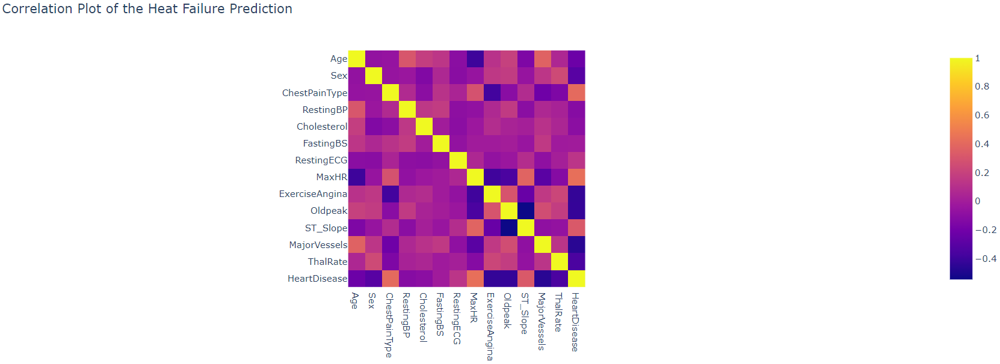
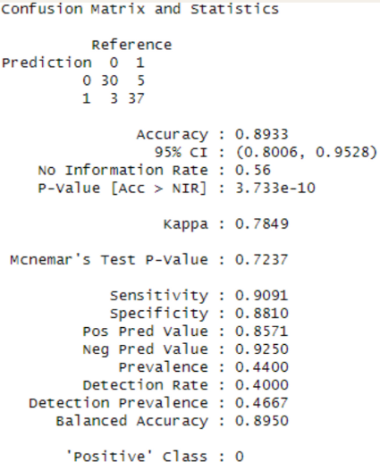

# Project Name: Data Mining - Heart Failure Prediction

This project acts as an assignment for the Data Mining module. Here we used the XGBoost Model to predict the likelihood of heart failure based on several parameters

## Introduction

A novel approach to heart failure prediction has been developed using a comprehensive algorithm that integrates diverse parameters such as ECG data, age, and blood pressure. This represents a significant leap forward from traditional methods that rely on isolated risk factors. The new algorithm provides a more nuanced understanding of an individual's cardiovascular health, enabling earlier detection and more personalized treatment of heart failure.

XGBoost:
- An optimized gradient boosting library designed to be highly efficient, portable, and flexible.
- great accuracy and performance
- can outperform other machine learning algorithms where data is structured, which is crucial for predicting complex outcomes
- can handle large datasets
- easily do regression, classification, and ranking problems
- can be used to develop a personal risk assessment for heart failure

## Dataset

The dataset used in this project is the “Heart Attack Analysis & Prediction Dataset” retrieved from kaggle and can be accessed through the link: https://www.kaggle.com/datasets/rashikrahmanpritom/heart-attack-analysis-prediction-dataset/data 

Columns of the dataset :
1. `Age`  = Age of the patient
2. `Sex` = Sex of the patient
3. `cp`  = Chest pain type (0 = Typical Angina, 1 = Atypical Angina, 2 = Non-anginal Pain,    3 = Asymptomatic)
4. `Trtbps`  = Resting blood Pressure (mmHg)
5. `Chol` = Cholesterol in mg/dl fetched via BMI sensor.
6. `Fbs`  = fasting blood sugar > 120 mg/dl (1 = True, 0 = False)
7. `restecg` = Resting electrocardiographic results (0 = Normal, 1 = ST-T wave normality, 2 = Left ventricular hypertrophy)
8. `Thalachh` = Maximum heart rate achieved.
9. `Old peak` = Previous peak
10.`slp` = Slope
11. `caa` = Number of major vessels
12. `thall` = Thallium Stress Test result (0 - 3)
13. `exng` = Exercise induced angina (1 = Yes, 0 = No)
14. `output` = Chances of heart disease (1 = More likely, 0 = Least likely) 
 

## Correlation Matrix
   
   
## Data Preprocessing

1. Removing Duplicate Rows
2. Removing Outliers
3. Split Train Test Data (Train 75%, Test 25%)

## Model

Model Used: XGBoost
Parameters:
- max.dept = 4
- nround = 90
- early_stopping_round = 3
- gamma = 1

  ## Evaluation
    

    Results:
  - Accuracy = 89.33%
  - Precision = 88.1%
  - Recall = 90.9%
  - F1 Score = 88.24%
 
  ## Conclusion
  The XGBoost model is able to achieve decent performance in predicting the likelihood of someone having a heart attack based on their medical data
